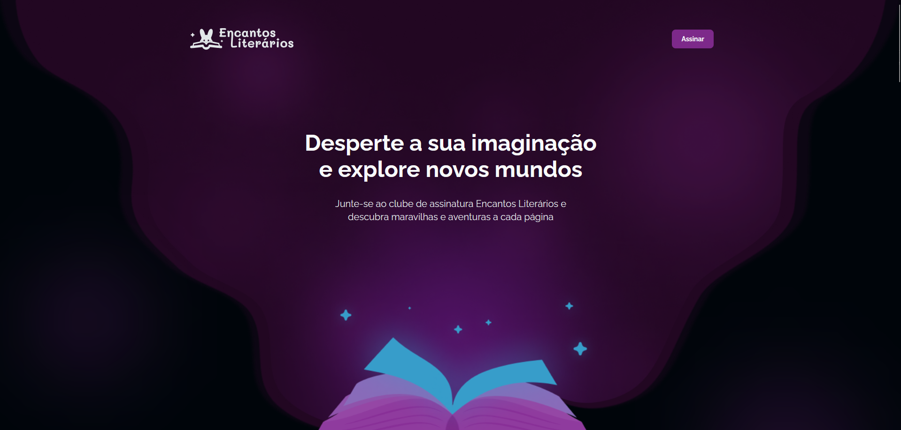

<h1 align="center"> 📖 Encantos Literários 📖</h1>

Projeto pessoal utilizando conceitos HTML e CSS.

  <a href="#-tecnologias">Tecnologias</a>&nbsp;&nbsp;&nbsp;|&nbsp;&nbsp;&nbsp;
  <a href="#-projeto">Projeto</a>&nbsp;&nbsp;&nbsp;|&nbsp;&nbsp;&nbsp;
  <a href="#-layout">Layout</a>&nbsp;&nbsp;&nbsp;

 

  

## 🚀 Tecnologias

Esse projeto foi desenvolvido com as seguintes tecnologias:

-   HTML e CSS
-   Git e GitHub
-   Figma

## 💻 Projeto

Encantos Literários é uma LandPage de um clube de assinatura de livros, onde o usuário assina um tipo de plano e recebe um livro temático com outros brindes e benefícios na plataforma. <a href="https://encantos-literarios-five.vercel.app/" target="_blank" rel="noopener noreferrer">aqui</a> para testar a página.

## 🎨 Layout

Clique <a href="https://www.figma.com/design/EYQw3CpLrq46k51zpwZ3XR/LP-de-Clube-de-Assinatura--Community-?node-id=3244-2758&m=dev">aqui</a> para conhecer a prototipagem do projeto.
 
 
 
 

Desenvolvido com ♥ by Mateus de Castro Macedo 👨‍💻

